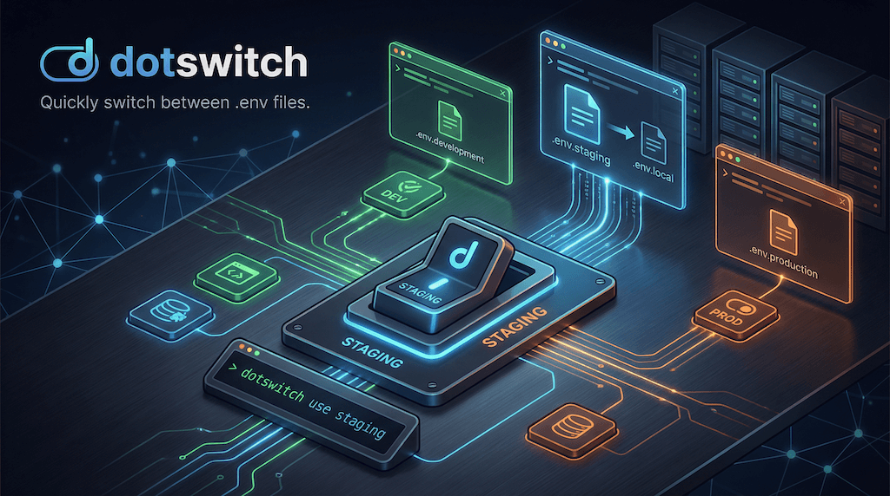

# dotswitch



[](https://github.com/natterstefan/dotswitch/actions/workflows/ci.yml)

Quickly switch between `.env` files. Copies `.env.<environment>` to `.env.local` (or a custom target) and tracks the active environment via a header comment. Works with Next.js, Vite, Remix, and any project that uses `.env` files.

## Install

```bash
npm install -g dotswitch
```

Or use directly without installing:

```bash
npx dotswitch use staging
```

## Usage

### Switch environment

```bash
# Switch to .env.staging → .env.local
dotswitch use staging

# Interactive picker (when no env specified)
dotswitch use

# Skip backup of existing .env.local
dotswitch use production --no-backup

# Force switch even if already active
dotswitch use staging --force

# Preview what would happen without making changes
dotswitch use staging --dry-run
```

### List available environments

```bash
dotswitch ls
```

```
Available environments:

▸ staging (active)
  production
  preview
```

JSON output for scripts:

```bash
dotswitch ls --json
# [{"name":".env.staging","env":"staging","active":true},{"name":".env.production","env":"production","active":false}]
```

### Show current environment

```bash
dotswitch current
```

JSON output:

```bash
dotswitch current --json
# {"active":"staging"}
```

Pipe-friendly — outputs the plain env name when not a TTY:

```bash
ENV=$(dotswitch current)
```

### Restore from backup

```bash
# Restore .env.local from .env.local.backup
dotswitch restore
```

### Compare environments

```bash
# Compare current .env.local against .env.production
dotswitch diff production

# Compare two environments directly
dotswitch diff staging production

# Show actual values (not just key names)
dotswitch diff staging production --show-values

# JSON output
dotswitch diff staging production --json
```

### Options

All commands support:

| Flag | Description |
|------|-------------|
| `-p, --path <dir>` | Project directory (defaults to cwd) |
| `--json` | Output as JSON (machine-readable) |

`use` also supports:

| Flag | Description |
|------|-------------|
| `-f, --force` | Switch even if already active |
| `--no-backup` | Skip `.env.local` backup |
| `-n, --dry-run` | Preview what would happen |

## Configuration

Create a `.dotswitchrc.json` in your project root to customize behavior. Everything is optional — dotswitch works out of the box without a config file.

```json
{
  "target": ".env.local",
  "exclude": [".env.test"],
  "hooks": {
    "main": "production",
    "staging/*": "staging",
    "dev*": "development"
  }
}
```

| Field | Default | Description |
|-------|---------|-------------|
| `target` | `".env.local"` | File to write the active env to |
| `exclude` | `[]` | Additional env files to hide from `ls` |
| `hooks` | `{}` | Branch-to-env mappings for git hook auto-switching |

### Custom target file

By default dotswitch writes to `.env.local`, but some frameworks use `.env` directly. Set the `target` field to change this:

```json
{
  "target": ".env"
}
```

## Git hook auto-switching

Automatically switch environments when you check out a branch.

### Setup

1. Add branch mappings to `.dotswitchrc.json`:

```json
{
  "hooks": {
    "main": "production",
    "staging/*": "staging",
    "develop": "development"
  }
}
```

2. Install the git hook:

```bash
dotswitch hook install
```

Now `git checkout staging/feat-login` will automatically run `dotswitch use staging`.

### Patterns

- `"main"` — exact branch name match
- `"staging/*"` — matches `staging/` prefix (e.g., `staging/feat-x`)
- `"dev*"` — matches any branch starting with `dev`

### Remove the hook

```bash
dotswitch hook remove
```

## Monorepo support

Switch environments across multiple packages at once using glob patterns:

```bash
# Switch all apps to staging
dotswitch use staging --path "./apps/*"

# Check status across packages
dotswitch ls --path "./packages/*"
```

Each directory is processed independently with labeled output.

## How it works

When you run `dotswitch use staging`, it:

1. Backs up your existing `.env.local` to `.env.local.backup`
2. Copies `.env.staging` to `.env.local`
3. Prepends a `# dotswitch:staging` header to track the active environment

The header comment is how `dotswitch ls` and `dotswitch current` know which environment is active.

## Programmatic API

dotswitch exports its core functions for use in scripts:

```ts
import {
  listEnvFiles,
  switchEnv,
  getActiveEnv,
  restoreEnvLocal,
  loadConfig,
  parseEnvContent,
  diffEnvMaps,
} from "dotswitch";

const files = listEnvFiles(process.cwd());
const active = getActiveEnv(process.cwd());
switchEnv(process.cwd(), "staging", { backup: true });
```

## Requirements

- Node.js >= 20

## License

MIT
